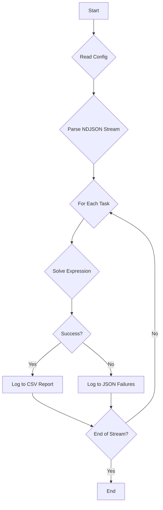

# Symbolic Expression Solver Architecture

## 1. Overview

This document outlines the architecture for `expression_solver.py`, a Python script designed to parse and solve symbolic mathematical expressions. The script reads tasks from a newline-delimited JSON (NDJSON) file, processes each expression using `sympy`, and logs the results to separate output files for successful and failed tasks.

## 2. Core Components

The script is composed of the following key components:

- **Configuration Manager**: Responsible for parsing `config.ini`.
- **Task Parser**: Handles streaming and parsing of the NDJSON input file.
- **Expression Solver**: The core engine that evaluates expressions using `sympy`.
- **Result Logger**: Manages writing outcomes to the appropriate report and log files.
- **Main Controller**: Orchestrates the overall workflow.

## 3. Workflow Diagram

## 4. Component Details

### 4.1. Configuration Manager (`config.py`)

- **Class `ConfigManager`**:
    - **`__init__(self, config_path)`**: Initializes by reading and parsing the `.ini` file.
    - **`get_paths(self)`**: Returns a dictionary of file paths from the `[Paths]` section.
    - **`get_settings(self)`**: Returns a dictionary of settings from the `[Settings]` section.

### 4.2. Task Parser (`parser.py`)

- **Function `parse_ndjson_stream(input_file)`**:
    - A generator function that reads the input file line by line.
    - Yields a dictionary for each valid JSON object.
    - Handles `json.JSONDecodeError` for malformed lines and logs them as failed tasks.

### 4.3. Expression Solver (`solver.py`)

- **Function `solve_expression(expression_str)`**:
    - Takes a mathematical expression as a string.
    - Uses a `try...except` block to catch potential errors during parsing and evaluation (`SyntaxError`, `ZeroDivisionError`, etc.).
    - Leverages `sympy.sympify` to safely convert the string to a `sympy` expression.
    - Evaluates the expression, solving equations where specified (e.g., `solve(...)`).
    - Returns a tuple: `(success: bool, result: any)`.

### 4.4. Result Logger (`logger.py`)

- **Class `ResultLogger`**:
    - **`__init__(self, success_path, failure_path)`**: Initializes with file paths for the CSV report and JSON log.
    - **`log_success(self, task_id, expression, result)`**: Appends a new row to the CSV file with headers `task_id`, `expression`, and `result`.
    - **`log_failure(self, task_id, expression, error)`**: Appends a new JSON object to the failure log file, including `task_id`, `expression`, and `error_message`.

### 4.5. Main Controller (`expression_solver.py`)

- **`main()` function**:
    - Initializes `ConfigManager` to get file paths.
    - Initializes `ResultLogger`.
    - Iterates through tasks from `parse_ndjson_stream`.
    - For each task, calls `solve_expression`.
    - Based on the outcome, calls the appropriate method on the `ResultLogger` instance.
    - Implements overall error handling and logs summary statistics.