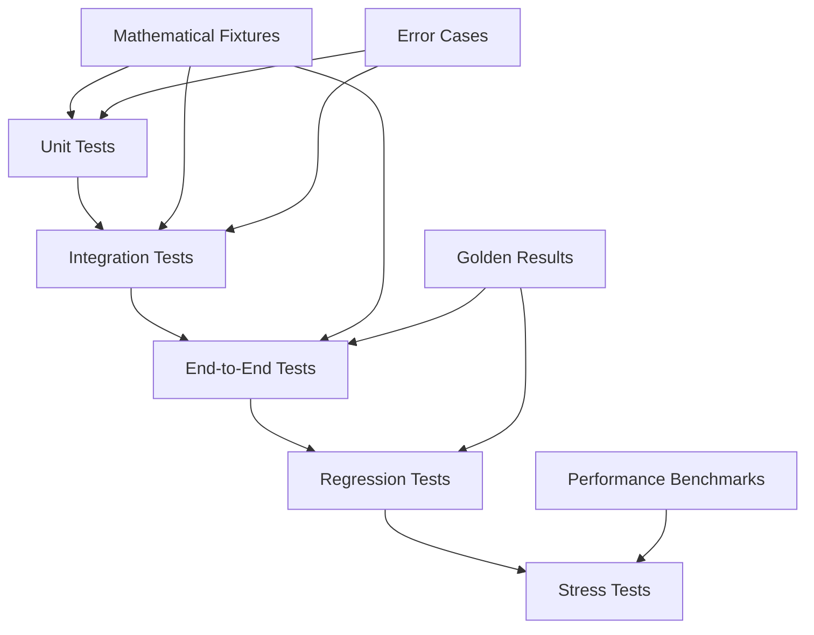

# Comprehensive Testing Architecture Plan for MathIR Parser

## Executive Summary

This document presents a comprehensive testing architecture designed to achieve 95%+ code coverage and ensure mathematical accuracy validation for the MathIR Parser project. The architecture focuses on systematic testing of all mathematical operations (integrals, limits, sums, equations, etc.) across three main components: `mathir_parser`, `expression_solver`, and `llm_parser`.

## 1. Current Project Analysis

### 1.1 Component Responsibilities

#### MathIR Parser (`mathir_parser/`)
- **Core Functions**: 47 functions including LaTeX parsing, mathematical execution
- **Key Components**:
  - `to_sympy_expr()`: LaTeX to SymPy conversion (323 lines)
  - `run_mathir()`: Main execution engine
  - 12 execution functions: `exec_integral`, `exec_limit`, `exec_sum`, `exec_solve`, etc.
  - 15 mathematical target types supported
- **Mathematical Operations**: Integrals, limits, sums, equation solving, inequalities, matrix operations, probability, geometry

#### Expression Solver (`expression_solver/`)
- **Core Functions**: 8 functions for SymPy expression processing
- **Key Components**:
  - `solve_expression()`: SymPy-based mathematical solver
  - `parse_ndjson()`: Input data processing
  - Error handling and logging infrastructure
- **Data Flow**: NDJSON input → SymPy processing → CSV/JSON output

#### LLM Parser (`llm_parser/`)
- **Core Functions**: 20+ functions across 7 modules
- **Key Components**:
  - `client.py`: 3 LLM client implementations (OpenAI, Anthropic, Local)
  - `guard.py`: JSON schema validation with 15 target types
  - `prompt.py`: Prompt engineering and few-shot examples
  - `retry.py`: Error handling and retry logic
- **Integration**: Task processing → LLM generation → Validation → Output

### 1.2 Current Test Coverage Analysis

#### Existing Test Files
- `tests/test_main.py`: 25 test methods, comprehensive mathematical operations
- `tests/test_individual.py`: Parametrized testing of 200+ individual tasks
- `test_critical_fixes.py`: 6 critical regression tests
- `test_backward_compatibility.py`: 4 compatibility validation tests
- `expression_solver/test_expression_solver.py`: 4 pipeline tests
- `llm_parser/tests/`: 3 test files with integration, guard, and prompt testing

#### Mathematical Operation Coverage
- **Integrals**: Definite integrals, complex expressions, LaTeX parsing
- **Limits**: Infinity limits, trigonometric limits, algebraic limits
- **Sums**: Finite sums, geometric series, infinite series
- **Equation Solving**: Linear systems, quadratic equations, matrix equations
- **Inequalities**: Simple and complex inequality solving
- **Matrix Operations**: Inverse, determinant, equation solving
- **Probability**: Distributions, event expressions
- **Advanced**: Double integrals, area between curves, optimization

## 2. Testing Gaps and Missing Coverage Areas

### 2.1 Critical Gaps Identified

#### Unit Testing Gaps
- **LaTeX Parsing**: Limited edge case coverage for `to_sympy_expr()`
- **Runtime Context**: Insufficient testing of `build_runtime()` with complex definitions
- **Error Handling**: Missing systematic error condition testing
- **Validation Logic**: Limited testing of mathematical domain violations

#### Integration Testing Gaps
- **Cross-Component**: No tests for mathir_parser ↔ expression_solver integration
- **Data Flow**: Missing end-to-end pipeline validation
- **LLM Integration**: Limited testing of LLM → MathIR → Execution flow

#### Performance and Stress Testing Gaps
- **Large Expressions**: No testing with complex mathematical expressions
- **Memory Usage**: No memory profiling for large datasets
- **Concurrent Processing**: Missing concurrency testing
- **Timeout Handling**: No testing of long-running mathematical computations

#### Mathematical Accuracy Gaps
- **Numerical Precision**: Limited validation of decimal rounding accuracy
- **Symbolic vs Numerical**: Insufficient testing of exact vs decimal modes
- **Edge Cases**: Missing tests for mathematical edge cases (division by zero, undefined limits)
- **Domain Validation**: Limited testing of mathematical domain constraints

## 3. Comprehensive Test Architecture Design

### 3.1 Test Structure Overview

```
tests/
├── unit/                           # Unit tests for individual functions
│   ├── mathir_parser/
│   │   ├── test_latex_parsing.py          # LaTeX → SymPy conversion
│   │   ├── test_runtime_context.py        # Runtime building and symbol management
│   │   ├── test_execution_engines.py      # Individual exec_* functions
│   │   └── test_validation.py             # Input validation and error handling
│   ├── expression_solver/
│   │   ├── test_sympy_operations.py       # SymPy expression solving
│   │   ├── test_data_processing.py        # NDJSON parsing and output
│   │   └── test_error_handling.py         # Error scenarios and recovery
│   └── llm_parser/
│       ├── test_client_implementations.py # LLM client testing
│       ├── test_json_validation.py        # Schema validation
│       ├── test_prompt_engineering.py     # Prompt building and few-shot
│       └── test_retry_mechanisms.py       # Retry logic and error recovery
├── integration/                    # Integration tests between components
│   ├── test_mathir_pipeline.py            # MathIR creation → execution
│   ├── test_llm_to_mathir.py              # LLM output → MathIR validation
│   ├── test_cross_component.py            # Multi-component workflows
│   └── test_error_propagation.py          # Error handling across components
├── end_to_end/                     # Complete workflow testing
│   ├── test_mathematical_accuracy.py      # Mathematical correctness validation
│   ├── test_real_world_scenarios.py       # Complex mathematical problems
│   └── test_output_formats.py             # Exact vs decimal output validation
├── regression/                     # Regression and compatibility tests
│   ├── test_critical_fixes.py             # Known issue regression tests
│   ├── test_backward_compatibility.py     # API compatibility validation
│   └── test_mathematical_consistency.py   # Mathematical result consistency
├── stress/                         # Performance and stress tests
│   ├── test_large_expressions.py          # Complex mathematical expressions
│   ├── test_memory_usage.py               # Memory profiling and limits
│   ├── test_concurrent_processing.py      # Parallel execution testing
│   └── test_timeout_handling.py           # Long-running computation limits
├── fixtures/                       # Test data and utilities
│   ├── mathematical_expressions/          # LaTeX expression samples
│   │   ├── integrals.json                 # Integral test cases
│   │   ├── limits.json                    # Limit test cases
│   │   ├── sums.json                      # Sum test cases
│   │   ├── equations.json                 # Equation solving test cases
│   │   └── edge_cases.json                # Mathematical edge cases
│   ├── expected_results/                  # Golden standard results
│   │   ├── exact_results.json             # Symbolic computation results
│   │   ├── decimal_results.json           # Numerical computation results
│   │   └── error_cases.json               # Expected error scenarios
│   └── performance_benchmarks/            # Performance test data
│       ├── large_expressions.json         # Complex expression benchmarks
│       └── memory_profiles.json           # Memory usage benchmarks
└── utils/                          # Test utilities and helpers
    ├── test_helpers.py                    # Common test utilities
    ├── assertion_helpers.py               # Mathematical assertion helpers
    ├── data_generators.py                 # Test data generation
    ├── performance_profilers.py           # Performance measurement tools
    └── mathematical_validators.py         # Mathematical accuracy validators
```

### 3.2 Test Categories and Responsibilities

#### Unit Tests (95% Code Coverage Target)
- **Scope**: Individual functions and methods
- **Coverage**: Every function in mathir_parser, expression_solver, llm_parser
- **Focus**: Input validation, edge cases, error conditions
- **Mathematical Operations**: Each exec_* function tested independently

#### Integration Tests (Component Interaction)
- **Scope**: Multi-component workflows
- **Coverage**: Data flow between components
- **Focus**: Interface contracts, data transformation accuracy
- **Mathematical Operations**: End-to-end mathematical processing chains

#### End-to-End Tests (Mathematical Accuracy)
- **Scope**: Complete user workflows
- **Coverage**: Real-world mathematical problems
- **Focus**: Mathematical correctness, output format validation
- **Mathematical Operations**: Complex multi-step mathematical computations

#### Regression Tests (Stability Assurance)
- **Scope**: Known issues and critical fixes
- **Coverage**: Historical bug fixes, API compatibility
- **Focus**: Preventing regression of resolved issues
- **Mathematical Operations**: Previously failing mathematical computations

#### Stress Tests (Performance Validation)
- **Scope**: System limits and performance
- **Coverage**: Large datasets, complex expressions, concurrent processing
- **Focus**: Memory usage, execution time, system stability
- **Mathematical Operations**: Computationally intensive mathematical operations

## 4. Test Data Organization and Validation Strategies

### 4.1 Mathematical Test Data Structure

#### Expression Categories
```json
{
  "integrals": {
    "simple": ["x^2", "sin(x)", "e^x"],
    "complex": ["\\frac{2e^{2x} - e^x}{\\sqrt{3e^{2x} - 6e^x - 1}}"],
    "edge_cases": ["1/x", "tan(x)", "sqrt(x-1)"]
  },
  "limits": {
    "finite": ["x^2", "sin(x)/x"],
    "infinite": ["1/x", "n*cos(n^2 + e^n)/(2^n - 1)"],
    "indeterminate": ["0/0", "∞/∞", "0*∞"]
  },
  "sums": {
    "finite": ["n", "n^2", "1/n"],
    "infinite": ["1/2^n", "1/n^2", "1/n(n+1)(n+2)"],
    "convergence_tests": ["alternating", "ratio_test", "root_test"]
  }
}
```

#### Expected Results Validation
```json
{
  "exact_mode": {
    "integral_x_0_to_1": "1/2",
    "limit_sin_x_over_x": "1",
    "sum_geometric_series": "2"
  },
  "decimal_mode": {
    "integral_x_0_to_1": "0.500",
    "limit_sin_x_over_x": "1.000",
    "sum_geometric_series": "2.000"
  }
}
```

### 4.2 Validation Strategies

#### Mathematical Accuracy Validation
- **Symbolic Comparison**: Compare SymPy expressions for exact equality
- **Numerical Tolerance**: Validate decimal results within specified tolerance
- **Cross-Validation**: Compare results with external mathematical libraries
- **Domain Validation**: Ensure results respect mathematical domain constraints

#### Error Condition Validation
- **Invalid Input**: Test malformed LaTeX, invalid JSON schemas
- **Mathematical Errors**: Division by zero, undefined operations
- **Domain Violations**: Square root of negative numbers, log of zero
- **Convergence Issues**: Non-convergent series, undefined limits

## 5. Integration Points Between Test Types

### 5.1 Test Flow Integration



### 5.2 Shared Test Infrastructure

#### Common Test Utilities
- **Mathematical Assertion Helpers**: Custom assertions for mathematical equality
- **Test Data Generators**: Programmatic generation of test cases
- **Performance Profilers**: Memory and execution time measurement
- **Error Scenario Builders**: Systematic error condition generation

#### Cross-Test Validation
- **Result Consistency**: Ensure same mathematical problem produces consistent results
- **Performance Regression**: Track performance changes across test runs
- **Coverage Tracking**: Monitor code coverage across all test types

## 6. Testing Priorities and Implementation Roadmap

### 6.1 Phase 1: Foundation (Weeks 1-2)
**Priority: Critical**
- Implement unit tests for core mathematical functions
- Create mathematical test data fixtures
- Establish test utilities and assertion helpers
- Target: 80% unit test coverage

**Key Deliverables:**
- `test_latex_parsing.py` with 50+ LaTeX conversion tests
- `test_execution_engines.py` with comprehensive exec_* function tests
- Mathematical fixtures for all operation types
- Custom assertion helpers for mathematical equality

### 6.2 Phase 2: Integration (Weeks 3-4)
**Priority: High**
- Implement integration tests between components
- Create end-to-end mathematical accuracy tests
- Establish performance benchmarking
- Target: 90% integration coverage

**Key Deliverables:**
- `test_mathir_pipeline.py` with complete workflow tests
- `test_mathematical_accuracy.py` with 100+ accuracy validation tests
- Performance benchmarking infrastructure
- Cross-component error propagation tests

### 6.3 Phase 3: Validation (Weeks 5-6)
**Priority: High**
- Implement regression test suite
- Create stress and performance tests
- Establish continuous validation pipeline
- Target: 95%+ total code coverage

**Key Deliverables:**
- Complete regression test suite
- Stress testing for large expressions and concurrent processing
- Automated performance regression detection
- Mathematical consistency validation across all operations

### 6.4 Phase 4: Optimization (Weeks 7-8)
**Priority: Medium**
- Optimize test execution performance
- Implement advanced mathematical validation
- Create comprehensive documentation
- Target: Sub-minute test suite execution

**Key Deliverables:**
- Optimized test execution pipeline
- Advanced mathematical edge case coverage
- Complete testing documentation
- CI/CD integration with automated testing

## 7. Mathematical Accuracy Requirements Validation

### 7.1 Accuracy Metrics

#### Symbolic Computation Accuracy
- **Exact Mode**: 100% symbolic accuracy for all supported operations
- **Algebraic Simplification**: Consistent simplification across equivalent expressions
- **Domain Preservation**: Maintain mathematical domain constraints

#### Numerical Computation Accuracy
- **Decimal Mode**: Accuracy within specified rounding precision
- **Floating Point**: IEEE 754 compliance for numerical operations
- **Tolerance Validation**: Configurable tolerance for numerical comparisons

### 7.2 Coverage Requirements

#### Mathematical Operations Coverage
- **Integrals**: 95% coverage of integration techniques
- **Limits**: 95% coverage of limit evaluation methods
- **Sums**: 95% coverage of summation techniques
- **Equations**: 95% coverage of solving methods
- **Matrix Operations**: 100% coverage of supported operations

#### Error Handling Coverage
- **Input Validation**: 100% coverage of invalid input scenarios
- **Mathematical Errors**: 95% coverage of mathematical error conditions
- **System Errors**: 90% coverage of system-level error scenarios

## 8. Implementation Guidelines

### 8.1 Test Development Standards

#### Code Quality Standards
- **Test Naming**: Descriptive test names following `test_<operation>_<scenario>_<expected_result>` pattern
- **Documentation**: Comprehensive docstrings for all test functions
- **Assertions**: Use custom mathematical assertion helpers
- **Data Isolation**: Each test should be independent and isolated

#### Mathematical Test Standards
- **Precision**: Specify numerical precision requirements explicitly
- **Edge Cases**: Include boundary conditions and edge cases
- **Error Scenarios**: Test both success and failure paths
- **Performance**: Include performance expectations where relevant

### 8.2 Continuous Integration Requirements

#### Automated Testing Pipeline
- **Pre-commit**: Run unit tests and linting
- **Pull Request**: Run full test suite with coverage reporting
- **Nightly**: Run stress tests and performance benchmarks
- **Release**: Run complete validation including regression tests

#### Quality Gates
- **Code Coverage**: Minimum 95% code coverage required
- **Mathematical Accuracy**: 100% accuracy for supported operations
- **Performance**: No regression in execution time
- **Documentation**: All new tests must be documented

## 9. Success Metrics and Validation

### 9.1 Coverage Metrics
- **Unit Test Coverage**: 95%+ line coverage across all components
- **Mathematical Operation Coverage**: 100% of supported mathematical operations
- **Error Scenario Coverage**: 90%+ of identified error conditions
- **Integration Coverage**: 100% of component interfaces

### 9.2 Quality Metrics
- **Mathematical Accuracy**: 100% accuracy for exact mode computations
- **Numerical Precision**: Within specified tolerance for decimal mode
- **Performance**: Test suite execution under 5 minutes
- **Reliability**: 99%+ test success rate in CI/CD pipeline

## 10. Conclusion

This comprehensive testing architecture provides a systematic approach to achieving 95%+ code coverage while ensuring mathematical accuracy validation across all components of the MathIR Parser project. The phased implementation approach allows for incremental progress while maintaining focus on the critical mathematical accuracy requirements.

The architecture addresses current testing gaps through:
- Systematic unit testing of all mathematical operations
- Comprehensive integration testing between components
- End-to-end validation of mathematical accuracy
- Robust regression testing for stability
- Performance and stress testing for scalability

Implementation of this testing architecture will provide confidence in the mathematical correctness and reliability of the MathIR Parser system while supporting future development and maintenance activities.